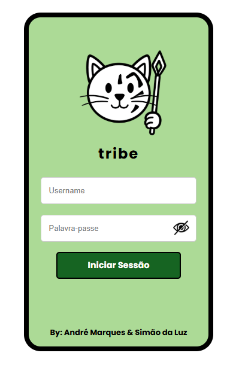
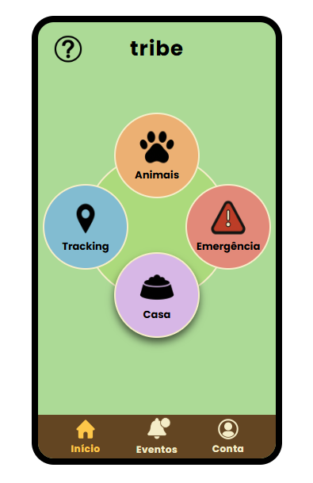
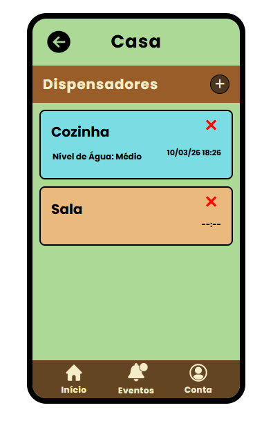
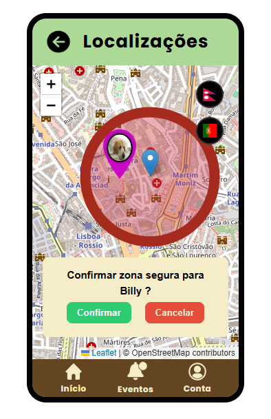
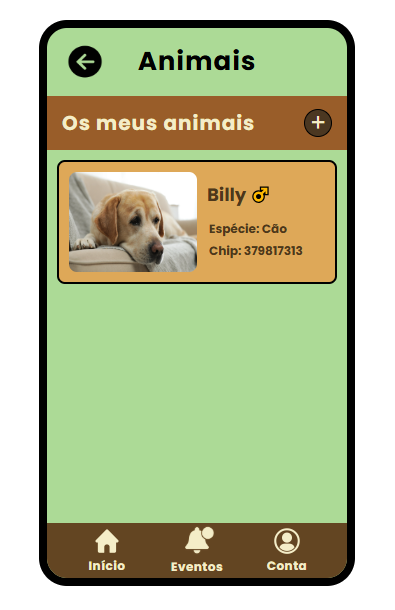
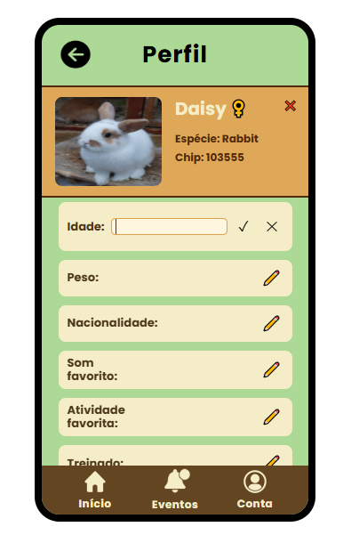
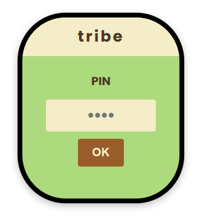
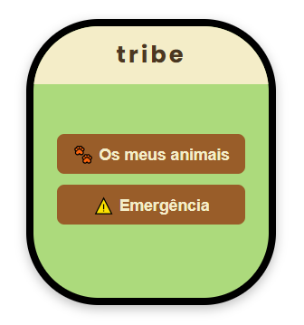
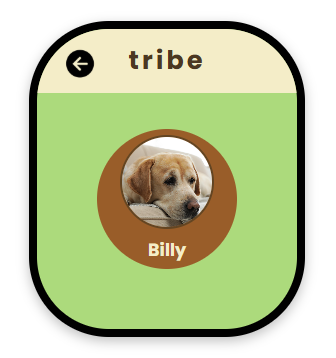

# Tribe - Pet Care Application

Academic project developed for the curricular unit **Interfaces Pessoa-Máquina (Human-Computer Interaction)** in **Licenciatura em Engenharia Informática** at **Faculdade de Ciências da Universidade de Lisboa (FCUL)**.

## Description

This project is a **prototype of a pet care application**, featuring a **mobile interface** and a **simplified smartwatch interface**.

## Screenshots

<h3 align="center">Mobile Phone</h3>

<table align="center">
<tr>
<td align="center">
 
Login
</td>

<td align="center">
 
Home
</td>

<td align="center">
 
Dispensers
</td>

<td align="center">
 
Tracking
</td>

<td align="center">
 
Pets List
</td>

<td align="center">
 
Pet Profile
</td>
</tr>
</table>
 

<h3 align="center">Smartwatch</h3>
<table align="center">
<tr>

<td align="center">
 
Login
</td>

<td align="center">
 
Home
</td>

<td align="center">
 
Pets List
</td>

</tr>
</table>

## Features

- Login simulation
- Pet management (view, add, remove, and customize pet profiles)
- Food and water dispenser management
- Pet location tracking simulation
- Safe zone configuration with exit alerts
- Emergency alert simulation
- Navigation between application screens
- Simplified smartwatch companion interface
- And more!

## Requirements

- Any modern web browser

## Running the Project

### Mobile App Prototype

To run the main mobile interface prototype:

1. Clone or download the repository.
2. Open the file:

`mobile-phone/login/login.html` in your web browser.

This page serves as the **entry point of the application** and allows navigation through the different screens of the prototype.

### Smartwatch Prototype

A simplified smartwatch prototype interface is also available.

To run it, open:

`smartwatch/login/smartwatch-login.html` in your web browser.

## Notes

The interface of the application is in **Portuguese**, as the project was developed for a university course in Portugal.

## Authors
